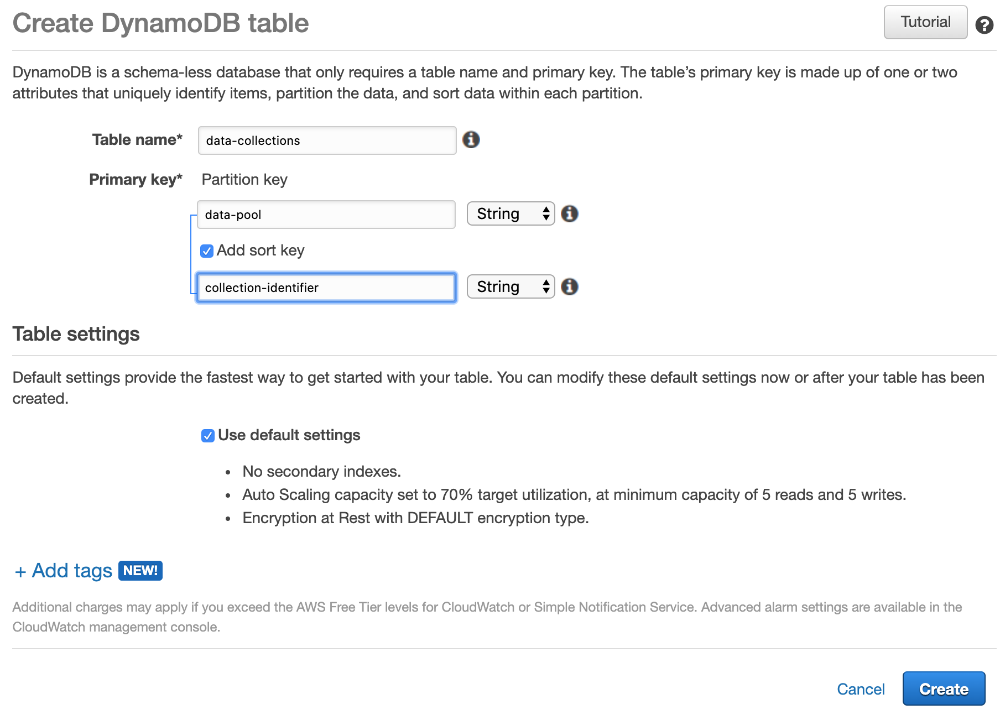

# Building a Data Lake That Can Scale to 1PB and Beyond

Big data applications are about handling masses of data (**High Volume**),
handling various type of content either having different schemata or
different types such as video data and unstructured data (**High Variety**),
and/or handling large bursts of data in a very short period of time
(**High Velocity**). These factors are known as the 3Vs of big data.
(Note that there has been additions to the 3Vs proposed such as Value as
  additioal factor. Yet, we will stick to the original ones as these are
  the most commonly agreed ones)

When we are talking about volume in the context of *big* data then we mean data
being larger in size to be handled on a single server. Or in other words,
we would consider a Peta Byte as big while we could handle a Tera Byte with
small data solutions.

Some consider the Hadoop eco system as the solution to cope with all big data
issues. However, some data intensive applications are by far too big so that
such a system could handle them efficiently. It would either be too complex or
too expensive.

Thus, here we want to show how to build a system that is capable to handle
very large sets of data efficiently. In the following we will provide
techniques needed to build and use a *data lake*. The Term *data lake* has
been used for various products in the past---maybe, it also has been used too
much or at least to much like a buzzword. However, we will not try and invent
a new term but rather use the Term *data lake* in the meaning to provide
a system to store various types of data in large quantities and enable
data usage patterns that follow the *Schema-on-Read* Approach.

Moreover, as artificial intelligence applications are on the rise there is
a also an increase in sets of data other than classical structured data such
as image or video data or audio data. These applications require intensive
data handling but the previously used techniques might not be sufficient to do
so. Yet, we will provide techniques with which we can handle these types of
data as well.

# Scenario: Satellite Data

Not every person has access to applications that require building a huge
data lake. Yet in order to illustrate the concepts in this document, we want
to use an open scenario which the interested reader can build on one's own.

Therefore, we picked analysing data from satellites as an illustrative example.
The Copernicus Open Access Hub is providing data from the Sentinel missions
with open access for free. Once registered, a user can download data from
satellite ground stations and use that data, e.g. for scientific purposes.

Each instrument in one of these satellites produces high resolution images or
readings in wavelengths we cannot see. There a many images taken per revolution
of a satellite and many observations of the same place per day. Hence, the
total amount of data for a region of interest might be quite huge. So, analysing
that data is nothing we want to do on our laptop or nothing we want to sit the
whole time of analysis next to it. We will need some means of automisation.

What we are planning to do is
- to search for data we are interested in
- to download these data
- to ingest these data into our data lake
- to make these data accessible for analyses
- to run some analyses, i.e. a set of script on these data that extract us some
new derived data we are interested in out of these masses of data
- to store these new derived data again in our data lake
- to visualise the derived data in a dashboard

We also want to
- update our data lake daily
- recycle masses of data we are sure that we will no longer need them

In our scenario we will use data from the Copernicus Open Access Hub.

For our small scenario let us assume that we want to analyse the bush fires
in New South Wales for the season 2019/2020. The Sentinel-3 Satellite provides
us with data about *Sea and Land Surface Temperature Radiation* (*SLSTR*), as
well as it is equipped with an *Ocean and Land Color Instrument* (*OLCI*).

## Preparations when planning a similar analysis on one's own

If the reader is interested in doing a similar analyis on one's own this subsectio
will provide links and hints to the necessary steps to do so.

There is a good guideline for the interested reader available at
https://scihub.copernicus.eu/userguide/
The guide is open for unregistered users but one has to register to use
the Copernicus Open Access Hub, documentation to that process
see https://scihub.copernicus.eu/userguide/SelfRegistration

Once registered one can either use the graphical user interface or search and
download data using the API. We will use the API to access data later as it
the only way for automisation.

However, it is good practise to use the graphical interface for first
exploratory searches until we know exactly what we are looking for.
One can find the graphical user interface at https://scihub.copernicus.eu/dhus/#/home
and its documentation at https://scihub.copernicus.eu/userguide/GraphicalUserInterface

The downloadable observations can be filtered by several criteria. Unfortunately,
the names of these criteria are non-selfexplanatory abbreviations. There is
a good starter describing the meaning of abbreviations stored at
https://sentinel.esa.int/web/sentinel/missions/sentinel-3/data-products

In the graphical user interface we found out that by searching for a position
around Canberra we receive images covering New South Wales and the East Coast
quite well. We can preview some of the images found whether or not they
contain the type of information we are looking for. That way we identify the
product type we are interested in. Finished doing this, we finally must
translate our selection into a query for the API access.

Information about to write such a query can be found at https://scihub.copernicus.eu/userguide/OpenSearchAPI
and the documentation how to access the result of such a query in a script at
https://scihub.copernicus.eu/userguide/BatchScripting

# Issues of Satellite Scenario

Before starting with setting up a data lake, let us consider for what purpose
we are building a data lake.

1. We want to support multiple scenarios. We assume that there will be
many analyses in the future. We do not want to build a data lake and all
of its functions again and again for them. As each scenario
1. We want to have persistent data, meaning that we do not want to loose data or if that cannot be avoided we want to be able to remedy that loss
1. We want to avoid unnecessary cost.
1. We want to limit maintaining efforts.
1. We want to be fast.
1. We want traceability / data lineage so that we can trust our results or re-do them when needed

# Using the Cloud to Set-Up a Data Lake

In the following sections we will discuss how to cope with the challenges
mentioned in the previous section. We will use a public cloud provider to
set-up our data lake there.

Some of the issues we want to handle favour building a solution in a cloud.
As the cloud providers usually offer managed services we can transfer the
need for operational tasks to them. Additionally, we are able to create
resources in large quantities when needed in order to be fast but can also
get rid of them again when the job is done.

The sample code we will provide is runnable in AWS cloud,
https://aws.amazon.com/ .
We will mention what the interested reader has to change if one is
intending to make a similar system.

Although the samples are written for AWS in mind, these samples
and the herein mentioned concepts are
not limited to that cloud provider. Providers such as Azure or
Ali Baba Cloud offer very similar services.

Some cloud providers offer *data lake as a service*. These services
shall make it easier to the user to set-up a data lake. However, a
data lake is not a product one can buy of the shelf---it usually
includes a lot of customising.

We will not use these managed services offering data lake as a service.
These services often are pre-packed collections of other services of that
cloud provider. Instead, we will build our data lake using these services
on our own and discuss why we use them and how to adapt them to
our needs. Hopefully, the effect of learning
will be greater that way.

# Design for Variety/Multiple Scenarios

A data lake uses the *schema-at-read* approach. That does not mean that
data in a data lake is schema-less. It means that the person doing an
analysis must know the structure and its meaning when reading data.

When inserting the data into a data lake the data lake does not enforce
a schema. Moreover, it will accept any data. However, this proceeding
might cause a lot of mess in the future after everyone has dumped one's
data in any form into the data lake. The terms *data dump* or *data swamp*
describe this phenomenon quite fittingly when the data lake has become
unusable. In a data swamp a user has to filter all the garbage away to
retrieve the useful results and chances are high that some garbage data will
find its way into results of analyses.

So, if the system does not reject inappropriate data from entering the
data lake then some other mechanism, even a organisatorial one, must be
in place.

One way to do this is implementing good *data governance*. Data
governance is also a term with a lot of buzzword potential.
If applied properly, *data governance* can help improving the quality
of a data handling system. Yet, if applied ill, it can be a waste of
time and resources, too.

Defining rules how to handle data is a part of good data governance.
Yet, these might be very specific to the organisation that is using them.
Let us discuss some common rules used in good data governance. We will
show later what a data lake must provide to enforce them.

A very common rule is **no data without an owner** or slightly modified
**no data without someone being responsible**. The intention of this rule is
to have a person at hand that can determine whether or not an element in
the data lake is still required or what it is for---or to clean it, if
it is messy. Such a rule is easy to demand but hard to maintain. Special
cases have to be considered and there must be processes to handle them.
For instance, what happens to data if the owner is changing one's job?
Will there be a new owner or will the data be deleted?

Handling personally identifyable data (PII) is restricted in many countries.
For instance, the *GDPR* law of the European Union demands
that there must be valid purpose why some PII is stored. Thus, it is good
practise to introduce a data governance rule such as **each data item
must have documented the purpose why it has been collected**, if PII data
could be inserted. This is a good example for a rule only applicable for
specific organisations. In our satellite scenario no data set contains
PII as the resolution of images is too coarse-grained for that purpose.
In contrast to that, a bank should implement such a rule whenever it
stores data of customers in a data lake. Are these data collected to
rate their customers' loans? Then this data could be used to determine
if the collaterals are sufficient to hand out a new loan or not. Yet,
using that same data for marketing purposes might be a no-go if there is
no explicit consent of the customer.

Another common rule is **no data without lineage** meaning that it must
be obvious where an element has came (or what its ancestor elements were)
from and what happened to it while it has been processed.

Having written that, let us discuss what we need to implement data governance
in a data lake. As mentioned above, we need to know what is inside the
data lake. Additionally, we have to store the attributes we require according
to our data governance rules somewhere.

## Organise the Data Lake in Pools, Collections, and Files

First of all we have to organise the content of the data lake somehow. Yet,
this organisation should be generic so that we can use the same structure
for different purposes without changing it all the time.

One way to organise the data lake is to split the data lake logically into several
smaller ones like zones, ponds, or pools. We will stick to the Term *data pool*
in the remainder of this text. Think of a data pool as an area in the data lake
for which one person is responsible to administrate it, i.e. regulating the
inflow of data and doing the cleaning stuff. Using this split strategy we
can easily implement the data governance rule that is demanding we should
always have an owner for each item. In that case the owner of the data pool is
responsible for all elements within a data pool.

As data in a data lake can come in various forms, one has to agree on a very
generic way to store that data. It could be structured data which we can store
in a database. Yet, other data such as images or videos are hard to handle in
databases.
The most generic way to store all these types of data is to store them in
individual files. We can store structured data as files, too. Systems such
Apache Presto allow us to handle folders containing json or yaml documents like
a database.

In the context of our satellite scenario individual files are organised together.
The satellite is doing a reading of its sensors in several intervals and each
reading consists of several files. Other scenarios follow the same strategy.
Think of the training of a deep neural network for image recognition.
There will be a set of images stored in files bundled together forming
a training set. The resulting model might itself be another collection of files
in which the weights of the trained network is stored. As one can see, this
way of organisation is quite generic.

So, let us organise our data lake as follows: the finest grain of our data lake
shall be an individual file which might be bundled together with others
into a data collection.
A data collection might have a type. A data lake may accept data collections of
specific types.

## Registering the Content in an Index or Data Catalog

Once the structure is defined, we also need a component in our data lake
that knows what elements are inside the data lake.

One way to avoid messing the data lake is to use a *data catalog* for all
elements in the data lake. This means one can still use any type of data
in the data lake but at least one has to document what has been inserted,
or where it is.

In AWS the service AWS Glue offers data catalog services in addition to other
services. Apache Atlas does provide data catalog services in the hadoop
ecosystem. Both systems work well when using structured data. Yet,
using these systems for the structures we intend to use, we would have to
use them in a way they were not designed.

In addition to a data catalog or as an alternative,
we can use an index of data in which we register every element in the data
lake once it has been inserted.

The index must contain the attributes *data_pool* and some
*data_collection_id*, which both form the primary key of our index. There
might be other attributes in which the owner of that data pool is interested in.
Yet, these attributes might vary. In our satellite scenario, this might
include information about the pass of the satellite or the time the reading
has been taken. In an image recognition scenario a specific label of the data
might be of more interest. Consequentially, we cannot enforce a schema for
all elements of that index.

In order to offer individual attributes we are using DynamoDB to store the
index elements with *data-pool* and *collection-identifier* being the key, or
in terms of DynamoDB the partition key (data collection) and a sort key
(collection identifier).
We have chosen DynamoDB for convenience reasons as there is a free contingent.
Although our sensor readings are quite substantial in size, the index will not.
Yet, many other NoSQL databases such as MongoDB or Cassandra will be be
sufficient, too.



Once the table is created we can access its definition by calling
```
aws dynamodb describe-table --table-name <our table name>
```
The result should look similar to the following:
```json
{
    "Table": {
        "AttributeDefinitions": [
            {
                "AttributeName": "collection-identifier",
                "AttributeType": "S"
            },
            {
                "AttributeName": "pool-name",
                "AttributeType": "S"
            }
        ],
        "TableName": "collections",
        "KeySchema": [
            {
                "AttributeName": "pool-name",
                "KeyType": "HASH"
            },
            {
                "AttributeName": "collection-identifier",
                "KeyType": "RANGE"
            }
        ],
        "TableStatus": "ACTIVE",
        "CreationDateTime": "2020-04-23T13:43:22.116000+02:00",
        "ProvisionedThroughput": {
            "NumberOfDecreasesToday": 0,
            "ReadCapacityUnits": 5,
            "WriteCapacityUnits": 5
        },
        "TableSizeBytes": 26700,
        "ItemCount": 100,
        "TableArn": "arn:aws:dynamodb:eu-west-1:<your-account-id>:table/data-collections",
        "TableId": "<id generated by the system>"
    }
}
```

Each time new data is arriving we must register that data as a new collection.
We will describe the process how data is getting inside the data lake in
the next section.

# Comparing Data Warehouse ETL and Data Lake Ingest and Lifecycle Process

Data warehouses are designed to enable ad hoc analyses of large sets of
structured data by pre-processing them on load time.

The data warehouse usually is organised in layers, namely
- persistent staging area
- data warehouse layer
- data mart layer

The data warehouse is copying the data during the loading process from one layer
to the next layer beginning at the persistent staging area. During that process
it transforms the data, restructures it, and augments it. The same tuple will
look quite differently when the process is over.

During the insertion process into a data lake the inserted data
usually does not change.

The loading process in a data warehouse and the loading process into
a data lake have in common that
- there is a change in responsibility during the load process; once the process
is finished the data system (warehouse or lake) is responsible
- data is checked if it fulfills the data governance rules

In a data lake this process happens in a different way. An element in the
data like will follow a typical lifecycle instead of being modified:
- insert (some process is inserting a new element, can be from outside)
- curate (a central process of the data lake is checking the validity of an item---this process is triggered by the inserter at the end of insertion)
- use (data that fulfills the data governance rules can be used by users)
- recycle (an item is no longer needed and marked to be removed---there
  might be some reasons to delay deletion in order to undo erroneous deletions)
- delete (item ceases to exist)

A file that has been inserted into a data lake might be read multiple times.
Yet, usually it would not change its content. In the case of our satellite
scenario we insert a satellite reading only once. We might read its content
to extract some usefull information from it. Yet we rather would add an
additional file containing extracted or refined data instead of replacing
the old one. If we would do otherwise, we would destroy other persons the
ability to do their type of analyses.

## Virtual Stages Using Tags

If we do not change a file then it also does not make sense to move that
file from one storage container to another. That would only consume time
and cost money.
Thus, we only virtually move collections and files from one stage to the
next one.

Yet, this virtual moving is necessary because we want that users only
use data for their analyses which are curated
(i.e. the curation process has successfully ended for these collections)
and not yet recycled.

Object storage services provided by AWS (S3) and Azure (Blob) include a mechanism to
tag objects (i.e. a file). We are using tags to mark an object as being
part of a collection and a data pool. We also use it to mark the current
stage of that object. Doing so, the transfer from one stage to another
is just changing a single tag which is just an operation changing the
metadata of that object.

The nice feature of the tagging mechanism is that one can use it during
authorisation. We can specify that only specific scripts or users can
access objects in a specific state. For instance, we can define a lifecycle
rule that deletes all objects tagged as recycled after being two weeks
in that state. Or we can give only specific users the right to see data
that has not yet been curated, for instance the person that is responsible
to fix errors if some data governance rules have not been passed.

Here is an example of a policy that allows users to access data
of a specific data pool.

```json
{
    "Version": "2012-10-17",
    "Statement": [
        {
            "Sid": "VisualEditor0",
            "Effect": "Allow",
            "Action": [
                "s3:<List of Actions you want to allow>"
            ],
            "Resource": "*",
            "Condition": {
                "StringEquals": {
                    "s3:ExistingObjectTag/data-pool": "mgtest"
                }
            }
        }
    ]
}
```

# Design Data Processes for Cost
