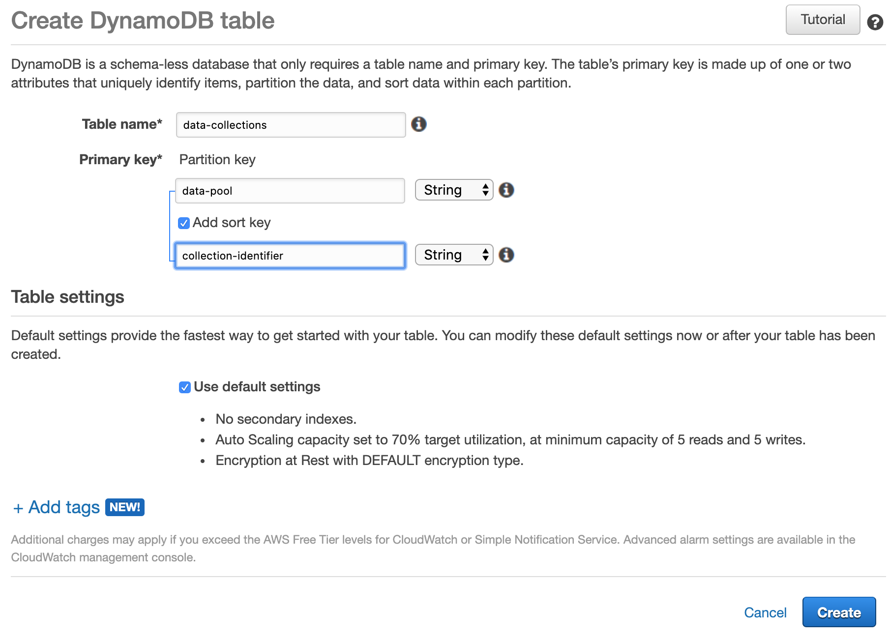

# Scenario: Satellite Data

Not every person has access to applications that require building a huge
data lake. Yet in order to illustrate the concepts in this document, we want
to use an open scenario which the interested reader can build on one's own.

Therefore, we picked analysing data from satellites as an illustrative example.
The Copernicus Open Access Hub is providing data from the Sentinel missions
with open access for free. Once registered, a user can download data from
satellite ground stations and use that data, e.g. for scientific purposes.

Each instrument in one of these satellites produces high resolution images or
readings in wavelengths we cannot see. There a many images taken per revolution
of a satellite and many observations of the same place per day. Hence, the
total amount of data for a region of interest might be quite huge. So, analysing
that data is nothing we want to do on our laptop or nothing we want to sit the
whole time of analysis next to it. We will need some means of automisation.

What we are planning to do is
- to search for data we are interested in
- to download these data
- to ingest these data into our data lake
- to make these data accessible for analyses
- to run some analyses, i.e. a set of script on these data that extract us some
new derived data we are interested in out of these masses of data
- to store these new derived data again in our data lake
- to visualise the derived data in a dashboard

We also want to
- update our data lake daily
- recycle masses of data we are sure that we will no longer need them

In our scenario we will use data from the Copernicus Open Access Hub.

For our small scenario let us assume that we want to analyse the bush fires
in New South Wales for the season 2019/2020. The Sentinel-3 Satellite provides
us with data about *Sea and Land Surface Temperature Radiation* (*SLSTR*), as
well as it is equipped with an *Ocean and Land Color Instrument* (*OLCI*).

## Preparations when planning a similar analysis on one's own

If the reader is interested in doing a similar analyis on one's own this subsectio
will provide links and hints to the necessary steps to do so.

There is a good guideline for the interested reader available at
https://scihub.copernicus.eu/userguide/
The guide is open for unregistered users but one has to register to use
the Copernicus Open Access Hub, documentation to that process
see https://scihub.copernicus.eu/userguide/SelfRegistration

Once registered one can either use the graphical user interface or search and
download data using the API. We will use the API to access data later as it
the only way for automisation.

However, it is good practise to use the graphical interface for first
exploratory searches until we know exactly what we are looking for.
One can find the graphical user interface at https://scihub.copernicus.eu/dhus/#/home
and its documentation at https://scihub.copernicus.eu/userguide/GraphicalUserInterface

The downloadable observations can be filtered by several criteria. Unfortunately,
the names of these criteria are non-selfexplanatory abbreviations. There is
a good starter describing the meaning of abbreviations stored at
https://sentinel.esa.int/web/sentinel/missions/sentinel-3/data-products

In the graphical user interface we found out that by searching for a position
around Canberra we receive images covering New South Wales and the East Coast
quite well. We can preview some of the images found whether or not they
contain the type of information we are looking for. That way we identify the
product type we are interested in. Finished doing this, we finally must
translate our selection into a query for the API access.

Information about to write such a query can be found at https://scihub.copernicus.eu/userguide/OpenSearchAPI
and the documentation how to access the result of such a query in a script at
https://scihub.copernicus.eu/userguide/BatchScripting

# Creating Index to Register Readings

In order to offer individual attributes we are using DynamoDB to store the
index elements with *data-pool* and *collection-identifier* being the key, or
in terms of DynamoDB the partition key (data collection) and a sort key
(collection identifier).
We have chosen DynamoDB for convenience reasons as there is a free contingent.
Although our sensor readings are quite substantial in size, the index will not.
Yet, many other NoSQL databases such as MongoDB or Cassandra will be be
sufficient, too.



Once the table is created we can access its definition by calling
```
aws dynamodb describe-table --table-name <our table name>
```
The result should look similar to the following:
```json
{
    "Table": {
        "AttributeDefinitions": [
            {
                "AttributeName": "collection-identifier",
                "AttributeType": "S"
            },
            {
                "AttributeName": "pool-name",
                "AttributeType": "S"
            }
        ],
        "TableName": "collections",
        "KeySchema": [
            {
                "AttributeName": "pool-name",
                "KeyType": "HASH"
            },
            {
                "AttributeName": "collection-identifier",
                "KeyType": "RANGE"
            }
        ],
        "TableStatus": "ACTIVE",
        "CreationDateTime": "2020-04-23T13:43:22.116000+02:00",
        "ProvisionedThroughput": {
            "NumberOfDecreasesToday": 0,
            "ReadCapacityUnits": 5,
            "WriteCapacityUnits": 5
        },
        "TableSizeBytes": 26700,
        "ItemCount": 100,
        "TableArn": "arn:aws:dynamodb:eu-west-1:<your-account-id>:table/data-collections",
        "TableId": "<id generated by the system>"
    }
}
```

Each time new data is arriving we must register that data as a new collection.
We will describe the process how data is getting inside the data lake in
the next section.

# The Overall Ingest Process

For doing our analyses, we first have to get the data into our system.
For this purpose we apply the following process.

- query for readings
- check which of these readings are new (not yet downloaded)
- start a batch job for each new reading
- perform batch job
- register readings (not yet implemented)

# Query for Readings

We implemented the query for potentially new readings in an AWS Lambda function.
Here is the example of a test event and how to call it.
```json
{
  "user": "<the user you received from copernicus>",
  "query": "https://scihub.copernicus.eu/dhus/search?q=(footprint:%22Intersects(-34.5000,148.5000)%22%20AND%20platformname:%22Sentinel-3%22%20AND%20producttype:%22OL_1_EFR___%22%20AND%20creationdate:%20[NOW-120DAYS%20TO%20NOW-30DAYS])&rows=100"
}
```

Here is the lambda function. It will retrieve the password from
the secretsmanager and then initiate a secured query to Copernicus.
Finally, it will parse the result and return a
list of titles, links, and sizes of readings.

You can use this function for your own analyses. Yet, you will
have to change the query accordingly.

Hint: Embedding the elements in " (%22) was quite easy to forget
and might finding errors quite hard.

```python
import json      # we will do some json parsing
import boto3     # we will use the boto3 aws client to retrieve the secretely stored password
import urllib    # we will make some REST calls
import xml.etree.ElementTree as ET   # we will have to parse the xml result of the REST call

def lambda_handler(event, context):
    # storing passwords in code is never a good idea.
    # hence, we will retrieve it from a secret password store proviced by aws secretmanager
    secret_name = "passwords"      # the name of your secret
    region_name = "eu-west-1"      # the region in which the secret is stored

    # Create a Secrets Manager client
    session = boto3.session.Session()
    client = session.client(
        service_name='secretsmanager',
        region_name=region_name
    )

    # when creating a secret in aws secretmanager
    # then the system will generate some sample code for you
    # this is a slightly modified version of that code

    # In this sample we only handle the specific exceptions for the 'GetSecretValue' API.
    # See https://docs.aws.amazon.com/secretsmanager/latest/apireference/API_GetSecretValue.html
    # We rethrow the exception by default.

    result_title = ""
    result =[]
    try:
        get_secret_value_response = client.get_secret_value(
            SecretId=secret_name
        )
    except ClientError as e:
        if e.response['Error']['Code'] == 'DecryptionFailureException':
            # Secrets Manager can't decrypt the protected secret text using the provided KMS key.
            # Deal with the exception here, and/or rethrow at your discretion.
            raise e
        elif e.response['Error']['Code'] == 'InternalServiceErrorException':
            # An error occurred on the server side.
            # Deal with the exception here, and/or rethrow at your discretion.
            raise e
        elif e.response['Error']['Code'] == 'InvalidParameterException':
            # You provided an invalid value for a parameter.
            # Deal with the exception here, and/or rethrow at your discretion.
            raise e
        elif e.response['Error']['Code'] == 'InvalidRequestException':
            # You provided a parameter value that is not valid for the current state of the resource.
            # Deal with the exception here, and/or rethrow at your discretion.
            raise e
        elif e.response['Error']['Code'] == 'ResourceNotFoundException':
            # We can't find the resource that you asked for.
            # Deal with the exception here, and/or rethrow at your discretion.
            raise e
    else:
        # Decrypts secret using the associated KMS CMK.
        # Depending on whether the secret is a string or binary, one of these fields will be populated.
        if 'SecretString' in get_secret_value_response:
            secret = get_secret_value_response['SecretString']

            # END of sample code, let us work with our data
            pw = json.loads(secret)['pw']
            html = ""
            user = event["user"]
            # we will use a password manager to do the handling of authentication
            password_mgr = urllib.request.HTTPPasswordMgrWithDefaultRealm()
            top_level_url = "https://scihub.copernicus.eu"
            password_mgr.add_password(None, top_level_url, user, pw)
            handler = urllib.request.HTTPBasicAuthHandler(password_mgr)
            opener = urllib.request.build_opener(handler)
            urllib.request.install_opener(opener)

            # let us create the url for Copernicus Open Data Hub
            # we expect the query in the parameter named query
            url = 'https://scihub.copernicus.eu/dhus/search?q='+event["query"]

            # as the opener has a password manager attached we can simply
            # open that url with authentication
            with opener.open(url) as response:
                html = response.read()
            root = ET.fromstring(html)
            # the resulting xml will be quite large
            # we will only need an identifier for the reading and the link
            # where we can download it later
            # additionally, we will store the size of the reading
            for entry in root.iter('{http://www.w3.org/2005/Atom}entry'):
                result_title = ""
                result_link = ""
                result_size = ""
                for title in entry.iter('{http://www.w3.org/2005/Atom}title'):
                    result_title = title.text
                for link in entry.iter('{http://www.w3.org/2005/Atom}link'):
                    ref = link.attrib['href']
                    # there are multiple links referenced in an entry,
                    # one for preview (marked Quicklook) and one actually for the content (containing $value)
                    if ref.find("/$value") > 0:
                        if ref.find("Quicklook") < 0:
                            result_link = ref
                for str in entry.iter('{http://www.w3.org/2005/Atom}str'):
                    if str.attrib['name'] == 'size':
                        result_size = str.text

                dummy = {'title': result_title, 'link': result_link, 'size': result_size}
                # append to our list of results
                result.append(dummy)


        else:
            decoded_binary_secret = base64.b64decode(get_secret_value_response['SecretBinary'])

    return {
        'statusCode': 200,
        'body': json.dumps(result)
    }
```

# Check Which Readings are New

Second, we are checking if the readings we got in the previous
step are already downloaded.

- check if a reading is already registered
  - yes: check if reading is not yet downloaded
    - yes: add to list to be downloaded
    - no: skip entry
  - no: register reading and add it to list to be downloaded
- return list to be downloaded

```python
import json
import boto3

def lambda_handler(event, context):
    # data pool name
    # make this a parameter when generalising that function in the future
    # for the moment it is hard-coded
    poolName = "bushfire"
    client = boto3.client('dynamodb')
    body = event["Input"]["Payload"]["body"]
    elements = eval(body)
    result = []
    for element in elements:
        title = element["title"]
        link = element["link"]
        size = element["size"]
        # check in dynamodb if the element already exists
        response = client.get_item(
            TableName='collections',
            Key={
                'pool-name': {'S': poolName},
                'collection-identifier': {'S': title}
            })
        try:
            item = response["Item"]
            # item found
            # if exists check if the status is indicating that it is already downloaded
            if item["status"]["S"] == "not-downloaded":
                dummy = {'title': title, 'link': link, 'size': size}
                result.append(dummy)
        except KeyError as e:
            # no item included --> does not exist --> insert it
            # insert element in dynamodb for non existing items
            response = client.put_item(
                Item={
                    'pool-name': {'S': poolName},
                    'collection-identifier': {'S': title},
                    'link': {'S': link},
                    'size': {'S': size},
                    'status': {'S': 'not-downloaded'}
                },
                TableName='collections')
            dummy = {'title': title, 'link': link, 'size': size}
            result.append(dummy)
        except Exception as e:
            print(e)
        # return a list of elements that have to be downloaded, i.e. those
        # that are new or not already downloaded
    return {
        'statusCode': 200,
        'body': json.dumps(result)
    }
```

# Start a Batch Job for Each Reading

The list of downloadable readings shall be downloaded now. To do so, we
will start a series of batch jobs. Copernicus Open Access Hub is limiting
downloads per user to an amount of two in parallel. In order to stick to this
limit we will submit batch jobs in AWS Batch that actually will do the download
for us. Yet, here we will create them as a sequence of jobs in which each job
is waiting for its predecessor to finish before starting.

```python
import json
import boto3

def lambda_handler(event, context):
    # instantiate batch client
    batch = boto3.client('batch')
    # parse event for payload
    payload = eval(event["Payload"]["body"])
    previous = "" # used to store previous job id
    for item in payload:
        title = item["title"] # identifier of the reading
        link = item["link"] # the URL where the content is downloadable
        print(title) # will document the reading's identifier in CloudWatch
        if previous == "":
            # we are in the first iteration
            # submit a new unconstrained batch job
            response = batch.submit_job(
                jobName= title,           # identifier
                jobQueue='batch-queue',   # the name of the queue in our account
                jobDefinition='batch-S3-helper:3', # our pre-configured job definition
                containerOverrides={  # let us add an additional environment variable named link
                    'environment': [
                        {
                            'name': 'link',
                            'value': link
                        },]
                },
                retryStrategy={'attempts': 2},
                timeout={'attemptDurationSeconds': 5000}
                # some satellite readings might be a few 100MB only
                # while others are quite big in size
                # so, choose a duration which you might be sure the
                # download will finish
            )
            print(response["jobId"]) # for log purposes
            # we want to make sure the jobs run sequentially
            # hence, we have to store the job id
            previous = response["jobId"]
        else:
            # there has be a previous job
            # let us create a job like we did for the first job
            # but now, we will make dependent on the previous job
            # so they will run sequentially
            response = batch.submit_job(
                jobName= title,
                jobQueue='batch-queue',
                dependsOn=[{'jobId': previous,'type': 'SEQUENTIAL'},],
                jobDefinition='batch-S3-helper:3',
                containerOverrides={
                    'environment': [
                        {
                            'name': 'link',
                            'value': link
                        },]
                },
                retryStrategy={'attempts': 2},
                timeout={'attemptDurationSeconds': 5000}
            )
            previous = response["jobId"]

    return {
        'statusCode': 200,
        'body': json.dumps('OK!')
    }
```


# Perform Batch Job

The previous job started a sequence of batch jobs.
Here are the details about the batch job and the batch environment used.

For the most part, we created a batch environment similar to the one described in this tutorial:
https://aws.amazon.com/de/blogs/compute/creating-a-simple-fetch-and-run-aws-batch-job/

Instead of the myjob.sh file mentioned in the above linked tutorial we used
the File getSatelliteData.sh instead.

In order to save cost, we have decided to use spot instances instead of on
demand instances but set the maximum cost to the on demand price. Thus, we
are sure that we can start our job when we submit it. Yet, in our experience
we have never had to pay something near the on demand price. Moreover, the
discounts have been quite substantial.

It is important to set the minimum VCPUs and desired VCPUs to zero. Otherwise,
the compute environment would spin up compute instances without having jobs
in the queue.


Here is the job description we used.

```json
{
    "jobDefinitionName": "batch-S3-helper",
    "jobDefinitionArn": "arn:aws:batch:eu-west-1:<your account id>:job-definition/batch-S3-helper:3",
    "revision": 3,
    "status": "ACTIVE",
    "type": "container",
    "parameters": {
        "BATCH_FILE_S3_URL": "s3://bucket/object",
        "BATCH_FILE_TYPE": "script"
    },
    "retryStrategy": {
        "attempts": 1
    },
    "containerProperties": {
        "image": "<your account id>.dkr.ecr.eu-west-1.amazonaws.com/batch-helper",
        "vcpus": 2,
        "memory": 2000,
        "command": [],
        "volumes": [],
        "environment": [
            {
                "name": "BATCH_FILE_S3_URL",
                "value": "s3://<your bucket where you put your shell script>/getSatelliteData.sh"
            },
            {
                "name": "user",
                "value": "<your user from Copernicus>"
            },
            {
                "name": "BATCH_FILE_TYPE",
                "value": "script"
            },
            {
                "name": "target",
                "value": "<the bucket name where you want the data transferred>"
            }
        ],
        "mountPoints": [],
        "ulimits": [],
        "resourceRequirements": []
    },
    "timeout": {
        "attemptDurationSeconds": 1000
    }
}
```
